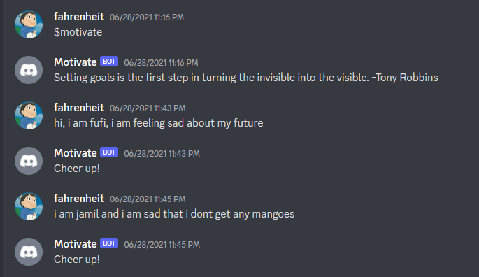
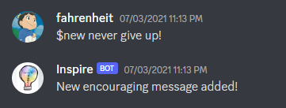
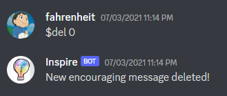

## Demonstration

* Using shortcut commands request inspiring messages from API, whereas emotional words detected in a sentence returns custom made messages.

 

* You can also add custom messages via shortcut keyword i.e <i>$new</i>

 
 
* For deleting custom messages, use <i>$del</i> followed by the index number.

 
 
